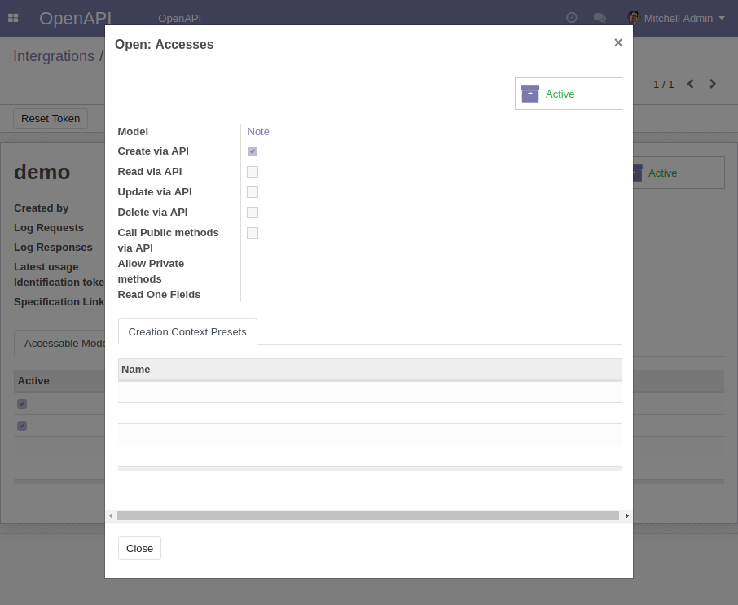

=========================================================
 Create Notes in Odoo from messages sent to Telegram bot
=========================================================

Here we'll make a telegram bot, that receives your message and create a Note in Odoo with the same content. You'll need:

* .. include:: ../../templates/you_need_telegram_to_create_bot.rst
* .. include:: ../../templates/you_need_aws_to_create_lambda.rst
* .. include:: ../../templates/you_need_odoo_openapi.rst

.. contents::
   :local:

Deployment
==========

Configure OpenAPI
-----------------

.. include:: ../../templates/configure_openapi.rst
..

* **Model**: Note (``note.note``)
* ``[x] Create via API``

Create a bot
------------

.. include:: ../../templates/create_telegram_bot.rst

Prepare zip file
----------------

.. include:: ../../templates/make_lambda_zip.rst

::

    mkdir /tmp/bot
    cd /tmp/bot

    pip3 install python-telegram-bot -t .
    pip3 install bravado -t .
    wget https://raw.githubusercontent.com/it-projects-llc/odoo-sync/master/doc-src/x2odoo/telegram2odoo-via-lambda/lambda_function.py
    zip -r /tmp/bot.zip *

Create Lambda function
----------------------

.. include:: ../../templates/create_lambda.rst

Runtime
~~~~~~~

Use ``Python 3.6``

.. image:: create-lambda.png

Function code
~~~~~~~~~~~~~

.. include:: ../../templates/upload_lambda_zip.rst

Environment variables
~~~~~~~~~~~~~~~~~~~~~

* .. include:: ../../templates/lambda_env_bot_token.rst
* .. include:: ../../templates/lambda_env_logging_level.rst
* .. include:: ../../templates/lambda_env_telegram_user_id.rst
* .. include:: ../../templates/lambda_env_openapi_json_url.rst
* .. include:: ../../templates/lambda_env_openapi_token.rst

Trigger
~~~~~~~
.. include:: ../../templates/lambda_trigger.rst

Register telegram webhook
-------------------------

.. include:: ../../templates/telegram_webhook.rst

Max execution time
------------------

.. include:: ../../templates/lambda_timeout.rst

Try it out
==========

* In telegram: send some messages to the bot

  .. image:: telegram-bot.png

* In Odoo: open menu ``[[ Notes ]]``
* RESULT: the notes are created

  .. image:: odoo-notes.png

* .. include:: ../../templates/check_odoo_cloudwatch_logs.rst

Source
======

Key script of the bot is presented below:

.. literalinclude:: lambda_function.py
   :language: python

.. include:: ../../templates/contactus.rst
